<div align="center">
  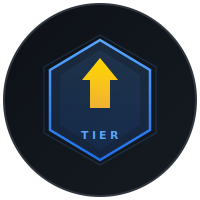
  <h1>GitHub Tier</h1>
  <p><strong>Gaming-style rank card for your GitHub profile</strong></p>
</div>

<p align="center">
  <a href="https://github.com/chahyunwoo/github-tier/stargazers"></a>
  <a href="https://github.com/chahyunwoo/github-tier/actions"></a>
  <a href="https://github.com/chahyunwoo/github-tier/blob/main/LICENSE"></a>
  <a href="https://github-tier.vercel.app"></a>
</p>

<p align="center">
  <a href="https://github-tier.vercel.app/api/tier?user=YOUR_USERNAME">View Demo</a>
  &middot;
  <a href="https://github.com/chahyunwoo/github-tier/issues">Report Bug</a>
  &middot;
  <a href="https://github.com/chahyunwoo/github-tier/issues">Request Feature</a>
</p>

---

<div align="center">
  
</div>

<br/>

## Quick Start

**1.** Copy the snippet below into your GitHub README:

```md
[](https://github.com/chahyunwoo/github-tier)
```

**2.** Replace `YOUR_USERNAME` with your GitHub username.

**3.** Done. Your rank card updates automatically every hour.

## Tier System

| Tier | Score | Top % |
|------|-------|-------|
| Challenger | 98+ | 0.01~0.05% |
| Grandmaster | 95-97 | 0.05~0.3% |
| Master | 90-94 | 0.3~1% |
| Diamond IV-I | 80-89 | 1~5% |
| Emerald IV-I | 65-79 | 5~15% |
| Platinum IV-I | 50-64 | 15~30% |
| Gold IV-I | 35-49 | 30~55% |
| Silver IV-I | 20-34 | 55~80% |
| Bronze IV-I | 8-19 | 80~95% |
| Iron IV-I | 0-7 | 95%+ |

Diamond+ tiers feature premium border glow effects. Master+ tiers use an elite emblem design.

### Examples

<table>
  <tr>
    <td align="center"><br/><b>Challenger</b></td>
    <td align="center"><br/><b>Grandmaster</b></td>
  </tr>
  <tr>
    <td align="center"><br/><b>Master</b></td>
    <td align="center"><br/><b>Diamond</b></td>
  </tr>
  <tr>
    <td align="center">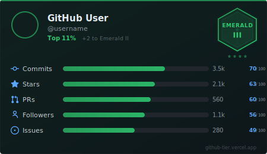<br/><b>Emerald</b></td>
    <td align="center"><br/><b>Platinum</b></td>
  </tr>
  <tr>
    <td align="center"><br/><b>Gold</b></td>
    <td align="center">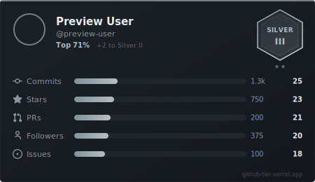<br/><b>Silver</b></td>
  </tr>
  <tr>
    <td align="center"><br/><b>Bronze</b></td>
    <td align="center">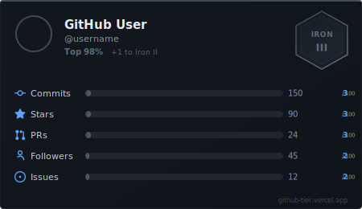<br/><b>Iron</b></td>
  </tr>
</table>

## Themes

Add `&theme=THEME_NAME` to the URL.

| Theme | Preview |
|-------|---------|
| `dark` (default) |  |
| `tokyonight` |  |
| `dracula` |  |
| `nord` |  |
| `gruvbox` |  |
| `catppuccin` |  |
| `onedark` |  |
| `radical` |  |
| `light` |  |

## How It Works

Your score is calculated using a **Log-Normal CDF** model, validated against 225+ randomly sampled GitHub users:

```
score = weighted_sum(
  commits   x 5,    // CDF median: 250
  stars     x 3,    // CDF median: 3
  prs       x 1,    // CDF median: 5
  followers x 0.5,  // CDF median: 3
  issues    x 0.5   // CDF median: 2
) / total_weight
```

- **CDF function**: `f(x) = x / (1 + x)` - smooth 0-100 score with diminishing returns
- **Data source**: GitHub GraphQL API (includes private contributions)
- **Refresh interval**: 1 hour (CDN cached)

## Options

| Parameter | Description | Default |
|-----------|-------------|---------|
| `user` | GitHub username (required) | - |
| `theme` | Card theme | `dark` |

## Deploy Your Own

<details>
<summary>Click to expand</summary>

### 1. Fork this repo

### 2. Create a GitHub Personal Access Token
- Go to [github.com/settings/tokens](https://github.com/settings/tokens)
- Generate a new token (classic)
- Select `read:user` scope
- Copy the token

### 3. Deploy to Vercel

[](https://vercel.com/new/clone?repository-url=https://github.com/chahyunwoo/github-tier&env=GITHUB_TOKEN&envDescription=GitHub%20Personal%20Access%20Token%20with%20read:user%20scope)

Add `GITHUB_TOKEN` as an environment variable in the Vercel dashboard.

### 4. Done

Your instance is live at `https://your-project.vercel.app/api/tier?user=USERNAME`

</details>

## Tech Stack

- **Runtime**: [Hono](https://hono.dev) + Vercel Serverless Functions
- **API**: GitHub GraphQL API + REST API
- **Rendering**: Server-side SVG generation
- **Testing**: Vitest (45 tests)
- **Architecture**: Feature-Sliced Design (FSD)

## Contributing

Contributions are welcome! Please open an issue first to discuss what you would like to change.

## License

[MIT](LICENSE)
